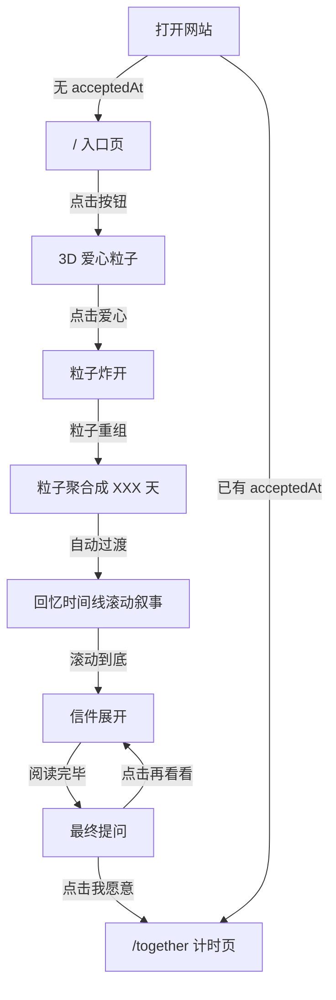

# 告白礼物网站 - 完整实现方案

## 0. 环境准备

当前机器未检测到 Node.js，需要先安装：

```bash
# 推荐使用 fnm (Fast Node Manager)
curl -fsSL https://fnm.vercel.app/install | bash
fnm install 20
fnm use 20
```

然后在 `/Users/zl5825/Desktop/love_xf` 下初始化 Next.js 项目：

```bash
npx create-next-app@latest . --typescript --tailwind --app --eslint --src-dir --import-alias "@/*"
npm install framer-motion three
npm install -D @types/three
```

---

## 1. 页面结构与交互流转

整个网站是一个 **单页应用**，通过状态切换和滚动驱动来推进叙事节奏，而不是路由跳转（避免 NFC 打开后的跳转割裂感）。唯一的例外是"在一起计时页"作为独立路由 `/together`，因为它需要在后续直接访问时独立展示。




**状态流转枚举**（主页内）：

- `intro` - 入口页
- `heart` - 3D 爱心粒子展示（含心跳 + 旋转 + 点击爆炸 + 粒子重组天数，全部在 HeartCanvas 内完成）
- `story` - 时间线 + 信件 + 提问（进入可滚动的长页面区域）

---

## 2. 目录结构

```
src/
├── app/
│   ├── layout.tsx              # 根布局，全局字体/meta
│   ├── page.tsx                # 主页（状态机驱动各阶段）
│   ├── together/
│   │   └── page.tsx            # 在一起计时页（独立路由）
│   └── globals.css             # Tailwind + 全局样式
├── components/
│   ├── EntryScreen.tsx         # 入口页 UI
│   ├── HeartCanvas.tsx         # Three.js 3D 粒子爱心 + 心跳 + 炸开 + 粒子重组天数（四阶段动画）
│   ├── StoryTimeline.tsx       # 回忆时间线容器
│   ├── StoryCard.tsx           # 单个时间线节点卡片
│   ├── LetterSection.tsx       # 信件区域（信封展开 + 分段显示）
│   ├── ProposalSection.tsx     # 最终提问 + 按钮
│   ├── LoveTimer.tsx           # 在一起计时器组件
│   └── Background.tsx          # 全局背景氛围层
├── lib/
│   ├── date.ts                 # 日期计算工具函数
│   └── storage.ts              # localStorage 封装（预留 Supabase 接口）
├── data/
│   ├── story.ts                # 时间线节点数据
│   ├── letter.ts               # 信件正文数据
│   └── config.ts               # 全局配置（日期、文案等）
└── types/
    └── index.ts                # TypeScript 类型定义
```

---

## 3. 数据结构设计

### `data/config.ts` - 全局配置

```typescript
export const siteConfig = {
  metDate: "2024-10-01",
  entryTitle: "打开属于我们的故事",
  entryButton: "开始",
  proposalQuestion: "你愿意和我一起，把以后的时间也写进去吗？",
  acceptButton: "我愿意",
  declineButton: "再看看",
  togetherTitle: "我们在一起",
  togetherSubtitle: "每一秒，都是我想和你一起度过的",
};
```

### `data/story.ts` - 时间线节点

```typescript
export interface StoryNode {
  id: string;
  title: string;
  date?: string;
  description: string;
  image?: string; // 图片路径，先用占位
}

export const storyNodes: StoryNode[] = [
  { id: "first-meet", title: "初次相遇", date: "2024-10-01", description: "...", image: "/images/placeholder-1.jpg" },
  // 4~6 个节点
];
```

### `data/letter.ts` - 信件内容

```typescript
export const letterContent = {
  greeting: "写给你的信",
  paragraphs: ["第一段...", "第二段...", "第三段..."],
  closing: "永远属于你的人",
  signature: "",
};
```

### `lib/storage.ts` - 持久化封装

```typescript
interface StorageProvider {
  getAcceptedAt(): Promise<string | null>;
  setAcceptedAt(timestamp: string): Promise<void>;
}

// 当前实现：localStorage
class LocalStorageProvider implements StorageProvider { ... }

// 未来实现：Supabase
// class SupabaseProvider implements StorageProvider { ... }

// 统一导出
export const storage: StorageProvider = new LocalStorageProvider();
```

---

## 4. 核心技术实现思路

### 4.1 Three.js 3D 粒子爱心

使用原生 Three.js（非 React Three Fiber）实现真正的 GPU 加速 3D 粒子系统。

**渲染管线**：

- `THREE.WebGLRenderer`（alpha 透明背景，融合页面 Background）
- `THREE.PerspectiveCamera`（FOV 60，静止）
- `THREE.Points` + `THREE.BufferGeometry`（单次 draw call 渲染全部粒子）
- `THREE.ShaderMaterial`（自定义 GLSL 着色器 + AdditiveBlending）
- `EffectComposer` + `RenderPass` + `UnrealBloomPass`（Bloom 辉光后处理）

**3D 心形生成**：

- 使用参数方程 `x = 16sin³(t), y = -(13cos(t) - 5cos(2t) - 2cos(3t) - cos(4t))` 生成 2D 轮廓
- 弧长参数化采样保证均匀分布
- Z 轴深度使用半球截面 `z_max = THICKNESS * sqrt(1 - spread²)` 生成 3D 体积
- ~3000 颗粒子：30% 表面（定义轮廓）+ 70% 填充（饱满内部）

**自定义 GLSL 着色器**：

- Vertex Shader：`gl_PointSize` 基于距离衰减
- Fragment Shader：`smoothstep` 柔和边缘圆形点精灵
- `AdditiveBlending` + `depthWrite: false` 实现粒子叠加辉光

**Bloom 后处理**：

- `UnrealBloomPass`（strength ~0.8, radius ~0.4, threshold ~0.2）
- 让每颗粒子散发柔和光晕，视觉质感远超手动画圆

**四阶段动画**（接口 `{ onComplete: () => void }`，全部在同一个 Three.js 场景内完成）：

- **汇聚**：粒子从随机 3D 位置 lerp 到心形目标，stagger 延迟 + easeOutCubic
- **心跳**：~88 BPM 脉冲式心跳 + 粒子微游动 + 整体绕 Y 轴缓慢旋转
- **爆炸**：点击后粒子获得 3D 外飞速度，摩擦 + 重力，短暂散开
- **重组天数**：爆炸粒子重新聚合成 "XXX 天" 文字形态（技术方案见 4.2），停留 2-3 秒后调用 `onComplete()`
- 动画通过 JS 每帧更新 BufferAttribute 实现，GPU 负责渲染

**粒子颜色**：暖色调（玫瑰金 / 柔粉 / 暖白），不要纯红
**卸载清理**：renderer.dispose(), geometry.dispose(), material.dispose(), composer 清理

### 4.2 粒子重组天数（HeartCanvas 第四阶段）

粒子从爆炸散开状态重新聚合成文字，全部在 HeartCanvas 的 Three.js 场景内完成，不需要单独的 DaysCounter 组件。

**技术方案**：

1. 使用隐藏的 `<canvas>` 2D 渲染文字 "XXX 天"（`lib/date.ts` 的 `daysBetween()` 计算天数）
2. 读取该 canvas 的像素数据 `getImageData()`，收集所有不透明像素的 (x, y) 坐标
3. 从中随机采样 3000 个坐标作为粒子的新目标位置（归一化到 Three.js 世界坐标）
4. 爆炸阶段结束后，每颗粒子 lerp 到对应的文字目标位置（复用汇聚阶段的 easeOutCubic + stagger 延迟）
5. 文字完全成型后停留 2-3 秒，然后调用 `onComplete()` 过渡到下一阶段

**文字采样细节**：

- 字体使用系统无衬线体，加粗，字号足够大以获取足够像素点（如 200px）
- 采样时可按像素亮度加权，让笔画中心更密集、边缘更稀疏
- 坐标映射：canvas 像素坐标 → 居中归一化 → 乘以世界空间缩放因子
- 文字粒子布局为平面（z ≈ 0），面向摄像机

### 4.3 回忆时间线

- 使用 CSS `scroll-snap-type: y mandatory` 实现全屏分页滚动
- 每个 `StoryCard` 占满一屏 (`min-h-screen` 或 `h-dvh`)
- 使用 Framer Motion 的 `useInView` 触发进入动画（fadeIn + translateY）
- 图片使用 `next/image` 配合 `placeholder="blur"` 占位
- 图片加入微视差：根据滚动偏移量做轻微 `translateY` 位移

### 4.4 信件区域

- 视觉上模拟信纸效果：半透明底色 + 细线边框 + 衬线字体
- 使用 Framer Motion `staggerChildren` 让段落逐个淡入
- 信件顶部有装饰性的信封翻开动画（CSS transform rotateX 从 180deg 到 0deg）
- 字体使用系统衬线字体或 Google Fonts 的 `Noto Serif SC`（中文衬线）

### 4.5 提问页与计时页

- 提问页全屏居中，问题文案 + 两个按钮
- "我愿意" 按钮点击后调用 `storage.setAcceptedAt(new Date().toISOString())`，然后 `router.push('/together')`
- "再看看" 按钮平滑滚动回信件区域
- 计时页使用 `setInterval(1000)` 每秒更新，计算 `days / hours / minutes / seconds`
- 计时页独立路由，`/together` 页面 `useEffect` 中检查 `acceptedAt`，无数据时跳回主页

### 4.6 背景氛围

- 全局 `Background` 组件：深色径向渐变底色 (`#0a0a0f` → `#1a1020`)
- 叠加极低透明度的噪点纹理（CSS background-image 用 inline SVG 或 tiny base64）
- 可选：少量缓慢漂浮的光斑粒子（用 CSS animation 而非 Canvas，避免性能冲突）

---

## 5. 性能策略

- 入口页零重动画，仅简单渐变 + 按钮呼吸光
- `HeartCanvas` 使用 `dynamic(() => import(...), { ssr: false })` 懒加载，不在服务端渲染
- HeartCanvas 使用 Three.js GPU 粒子系统：3000 颗粒子仅 1 次 draw call，远优于 Canvas 2D 逐粒子绘制
- Bloom 后处理增加 2-3 次全屏 pass，中端手机仍可 60fps；设置 `powerPreference: "high-performance"`
- 粒子炸开完成后完整清理 WebGLRenderer / Scene / Geometry / Material，释放 GPU 内存
- 时间线图片使用 `next/image` 的 `loading="lazy"` + `sizes` 响应式
- 计时页轻量，无重动画
- `three` 通过 tree-shaking 仅打包使用的模块（Points, ShaderMaterial, EffectComposer 等）

---

## 6. 移动端适配要点

- 使用 `dvh`（dynamic viewport height）替代 `vh`，解决 iOS Safari 地址栏问题
- 按钮最小 44x44px 点击区域
- 字体使用 `clamp()` 响应式缩放
- 滚动使用 `-webkit-overflow-scrolling: touch`
- meta viewport 设置 `viewport-fit=cover` 适配刘海屏
- 测试 `safe-area-inset` padding

---

## 7. 部署方案

- 项目根目录已有 git，直接推送到 GitHub
- 在 Vercel 中 Import 该 GitHub 仓库
- Framework Preset 自动检测为 Next.js
- 零配置部署，生成 URL 即可写入 NFC 卡片
- 后续绑定自定义域名在 Vercel Dashboard 设置

---

## 8. 后续修改指南（核心配置文件）


| 要修改的内容      | 文件路径                 |
| ----------- | -------------------- |
| 认识日期、页面文案   | `src/data/config.ts` |
| 时间线节点       | `src/data/story.ts`  |
| 信件正文        | `src/data/letter.ts` |
| 占位图片        | `public/images/` 目录  |
| 切换 Supabase | `src/lib/storage.ts` |


