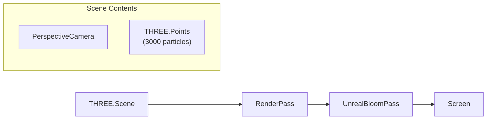

# Three.js 3D 粒子爱心 - 实现方案

## 概述

用 Three.js 完全重写 `HeartCanvas` 组件，从 Canvas 2D 手动投影升级为真正的 GPU 加速 3D 粒子系统，含 Bloom 辉光后处理。~3000 颗粒子，组件接口 (`onExplode`) 不变，`page.tsx` 无需修改。

---

## 1. 安装依赖

```bash
npm install three
npm install -D @types/three
```

仅新增一个运行时依赖 `three`（tree-shakable，粒子系统场景实际打包约 150-200KB gzip）。

---

## 2. 架构选型：原生 Three.js（非 R3F）

使用原生 Three.js 而非 `@react-three/fiber`，原因：

- 单一自包含组件，不需要 React 声明式 3D 场景图
- 动画本质是命令式的（useEffect + rAF），与现有模式一致
- 避免 R3F 对 React 19 的潜在兼容性问题
- 更少依赖，更小 bundle

---

## 3. 渲染管线




- **Renderer**: `THREE.WebGLRenderer` — alpha 透明背景，融合页面深色背景
- **Camera**: `THREE.PerspectiveCamera` — FOV 60, 静止不动（心形自转）
- **Geometry**: `THREE.BufferGeometry` — position / color / size / opacity 四个 BufferAttribute
- **Material**: `THREE.ShaderMaterial` — 自定义 GLSL 点精灵着色器 + AdditiveBlending
- **后处理**: `EffectComposer` + `RenderPass` + `UnrealBloomPass` — 柔和辉光

---

## 4. 3D 心形粒子生成

复用已有的弧长参数化采样 `arcLengthSample`，扩展为 3D：

```
对于参数 t 和径向因子 spread:
  x = hx(t) * spread
  y = hy(t) * spread
  z_max = THICKNESS * sqrt(max(0, 1 - spread^2))    // 半球截面
  z = random(-z_max, +z_max)
```

粒子分布：

- **表面粒子** (~30%): `spread ∈ [0.94, 1.06]`, z 薄层 — 定义轮廓
- **填充粒子** (~70%): `spread ∈ [0.05, 0.95]`, z 全深度 — 饱满内部

这给出一个真正的 3D 体积心形：边缘薄、中间厚的"气球"形态。

---

## 5. 自定义 GLSL 着色器

### Vertex Shader

```glsl
attribute float aSize;
attribute float aOpacity;
varying float vOpacity;

void main() {
  vec4 mvPos = modelViewMatrix * vec4(position, 1.0);
  gl_PointSize = aSize * (300.0 / -mvPos.z);  // 距离衰减
  gl_Position = projectionMatrix * mvPos;
  vOpacity = aOpacity;
}
```

### Fragment Shader

```glsl
varying float vOpacity;

void main() {
  float d = length(gl_PointCoord - 0.5);
  if (d > 0.5) discard;
  float alpha = smoothstep(0.5, 0.1, d) * vOpacity;  // 柔和边缘
  gl_FragColor = vec4(gl_FrontColor.rgb, alpha);       // 后备，实际用 vertexColors
}
```

用 `THREE.AdditiveBlending` + `depthWrite: false` 实现自然辉光叠加。

---

## 6. 三阶段动画（与现有逻辑一致）


| 阶段     | 逻辑                                             | 更新方式                                           |
| ------ | ---------------------------------------------- | ---------------------------------------------- |
| **汇聚** | 粒子从随机 3D 位置 lerp 到心形目标，stagger 延迟，easeOutCubic | JS 更新 position attribute, `needsUpdate = true` |
| **心跳** | 对所有目标位置施加周期缩放 `1 + 0.04 * sin(t)`, 微弱闪烁        | JS 更新 position + opacity attributes            |
| **爆炸** | 点击后每粒子获得 3D 外飞速度，摩擦 + 重力，透明度递减                 | JS 更新 position + opacity attributes            |


心形整体绕 Y 轴缓慢旋转（~15s 一圈），通过 `Points.rotation.y` 实现。

注意：动画通过 JS 每帧更新 `BufferAttribute` 实现（而非 uniform），因为每个粒子有独立状态。GPU 仅负责渲染。

---

## 7. Bloom 后处理配置

```typescript
import { EffectComposer } from "three/examples/jsm/postprocessing/EffectComposer.js";
import { RenderPass } from "three/examples/jsm/postprocessing/RenderPass.js";
import { UnrealBloomPass } from "three/examples/jsm/postprocessing/UnrealBloomPass.js";

const bloom = new UnrealBloomPass(
  new THREE.Vector2(w, h),
  0.8,   // strength — 辉光强度
  0.4,   // radius — 扩散半径
  0.2    // threshold — 亮度阈值（低 = 更多粒子发光）
);
```

Bloom 参数可以微调：strength 控制发光强度，radius 控制扩散范围。

---

## 8. 文件变更清单


| 文件                                                                 | 操作     | 说明                         |
| ------------------------------------------------------------------ | ------ | -------------------------- |
| `package.json`                                                     | 修改     | 新增 `three`, `@types/three` |
| `[src/components/HeartCanvas.tsx](src/components/HeartCanvas.tsx)` | **重写** | Canvas 2D → Three.js 全部替换  |
| `[src/app/page.tsx](src/app/page.tsx)`                             | **不变** | 接口不变，dynamic import 不变     |


只改一个组件文件 + 一个依赖安装。

---

## 9. 性能预期

- 3000 粒子 = 单次 `drawArrays` 调用（THREE.Points），GPU 轻松处理
- Bloom 后处理增加约 2-3 次全屏 pass，中端手机仍可 60fps
- `WebGLRenderer` 设置 `powerPreference: "high-performance"` 优先使用独立 GPU
- 组件卸载时完整清理 renderer/scene/geometry/material，释放 GPU 内存
- `alpha: true` + `setClearColor(0x000000, 0)` 保持背景透明，复用页面 Background 组件

